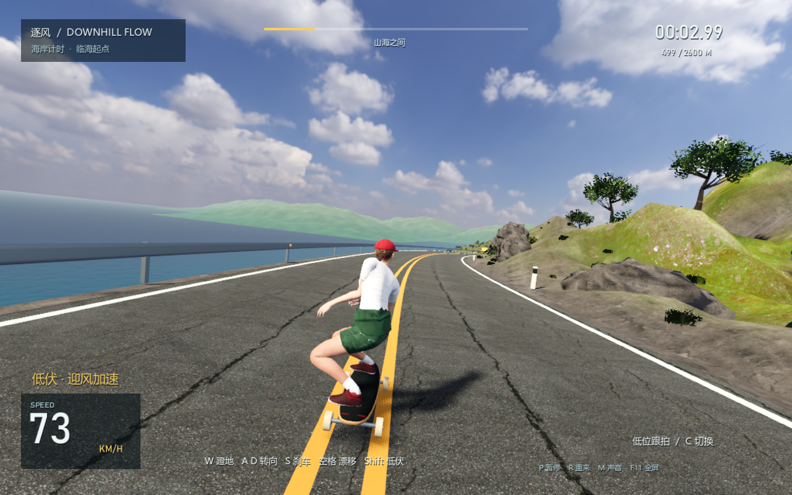
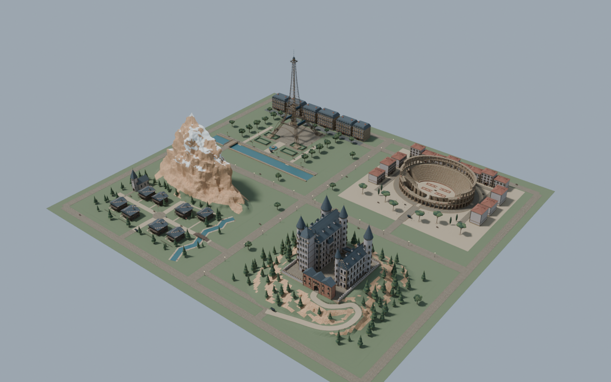
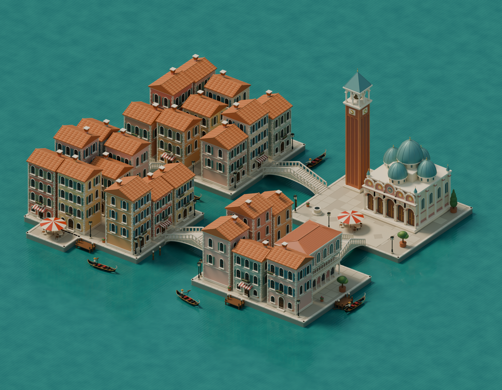
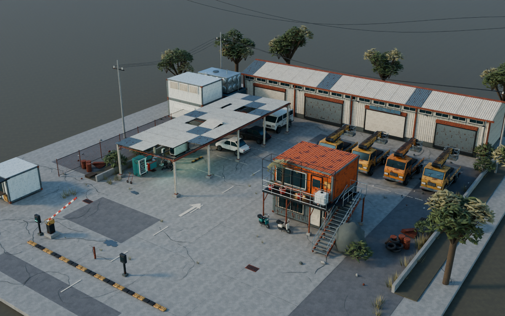
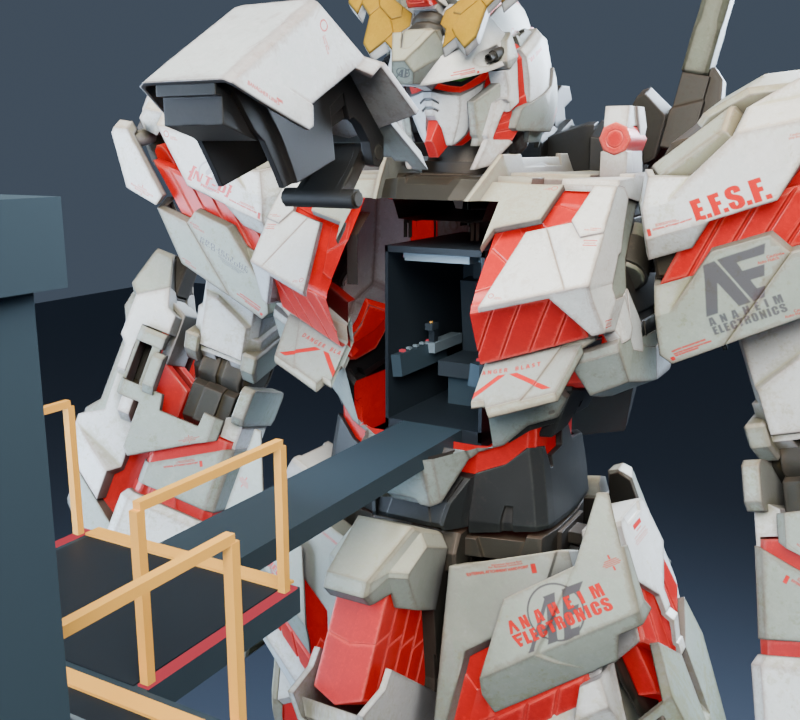

# 3D 建模与游戏作品集

更新至 **2026-09-24**：**5 个游戏项目、3 个独立建模项目**。9 月 15 日发布首批作品，9 月 24 日新增巨构机库。每个项目提供源码或可编辑模型、必要素材与中文说明。

## 游戏

| 项目 | 类型 | 主要内容 |
| --- | --- | --- |
| [公路滑板 · 逐风](游戏/公路滑板_DownhillFlow) | 滑板竞速 | 沿海公路、写实角色、连续蹬地、姿态与镜头 |
| [欧洲漫游 · 旅行手记](游戏/欧洲旅行探索游戏) | 旅行探索 | 四国景区、可进入建筑、地标互动、旅行记录 |
| [水城慢游](游戏/威尼斯水城游戏) | 水上探索 | 贡多拉、运河、码头与航线 |
| [最后一度电 · 断电区](游戏/最后一度电_废土枪战) | 第一人称单人关卡 | 废土场景、人物枪械、设备互动、任务流程 |
| [GUNDAM · 巨构机库](游戏/高达_巨构机库) | 第一人称机库探索 | 六机登舱、实体升降、实时监视器与启动检查 |

## 3D 建模

| 项目 | 可编辑工程 | 导出及用途 |
| --- | --- | --- |
| [欧洲四国旅行场景](建模/欧洲四国旅行场景) | Blender | 四区外景、GLB / FBX、LOD 与碰撞代理 |
| [威尼斯水城](建模/威尼斯水城) | Blender | 运河、建筑、桥梁、贡多拉与镜头 |
| [废土充电场](建模/废土充电场) | Blender | 工业场景、GLB 和浏览器 3D 查看器 |

游戏内的角色、枪械、可进入建筑源文件保留在各游戏的 `source/` 中；对应入口也列在 [建模索引](建模/README.md)。

## 作品预览

### 公路滑板 · 逐风

### 欧洲漫游

### 威尼斯水城

### 废土充电场

### GUNDAM · 巨构机库

上图为游戏几何 CPU 结构预览，非实时 GPU 截图。

## 获取与运行

1. 克隆仓库或下载源码 ZIP，保留 `游戏/` 与 `建模/` 的目录关系。
2. 游戏：安装 [Godot](https://godotengine.org/download/)，导入对应项目的 `project.godot`，等待资源导入后按 F5 运行。
3. 模型：安装 [Blender](https://www.blender.org/download/)，打开对应 `.blend`；贴图已打包，导出文件与源脚本随目录提供。
4. 废土场景浏览器预览：在该模型目录运行 `python source/serve_viewer.py`。

当前工程使用 Godot **4.7.2** 和 Blender **5.2.1** 制作与检查。Windows 启动脚本通过 `PATH` 中的 `godot` / `blender` 启动，也可设置 `GODOT_BIN` / `BLENDER_BIN`。仓库提供源码和模型快照，运行需要自行安装引擎。

## 发布说明

- [公开版处理与范围](PUBLICATION.md)：脱敏方式、目录取舍和公开版差异。
- [第三方资源与许可](THIRD_PARTY.md)：角色、摄影材质、字体与查看器依赖。
- [验证记录](VALIDATION.md)：本次发布副本的实际检查结果。
- `MANIFEST.sha256`：发布文件的完整性清单。

项目级许可证尚未指定；第三方代码与资产按各自随附许可提供。预览为已有实机截图或场景渲染，实际画质与帧率取决于设备和设置。
