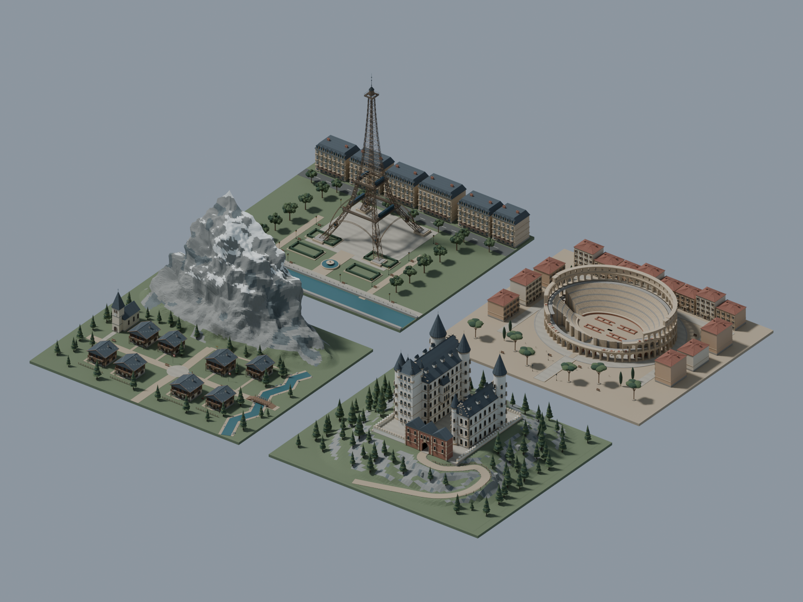

# 欧洲四国旅行场景

法国巴黎、意大利罗马、瑞士阿尔卑斯和德国巴伐利亚的四区游戏外景。

## 打开与编辑

使用 Blender 5.2.1 打开 [欧洲四国旅行场景.blend](欧洲四国旅行场景.blend)。模型贴图已打包；编辑前可另存一个工作版本。

包含各区 GLB、FBX、LOD 与碰撞代理，以及一个组合 GLB。

## 预览



## 重新生成

在本项目目录运行：

```console
blender --background --python scripts/build_scene.py -- --skip-render
```

重建会更新本目录下的生成文件。

[第三方资源与许可](../../THIRD_PARTY.md) · [公开版处理](../../PUBLICATION.md) · [返回建模索引](../README.md)
