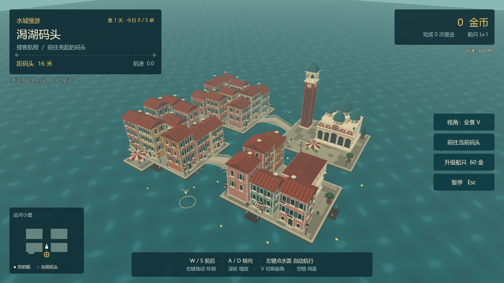

# 水城慢游

以贡多拉游览威尼斯风格水城的探索原型，包含镜头切换、码头、航线与船只运动。

## 运行

使用 Godot 4.7.2 导入 `project.godot`，首次等待资源导入，然后按 F5。Windows 可双击 `开始游戏.cmd`；启动前需要安装 Godot 并设置 PATH 或 `GODOT_BIN`。

驾驶、泊船及镜头操作按游戏内提示操作。

## 项目文件

- `project.godot`、`main.tscn`：引擎入口。
- `scripts/`：游戏逻辑。
- `assets/`：游戏所需模型、贴图、声音与数据。
- `tests/`：现有的行为与场景检查脚本。

场景来自建模分类的威尼斯水城，游戏目录包含自足的 city.glb 与 gondola.glb。

## 预览

## 来源与发布

[第三方资源与许可](../../THIRD_PARTY.md) · [公开版处理](../../PUBLICATION.md) · [验证记录](../../VALIDATION.md) · [返回作品集](../../README.md)
