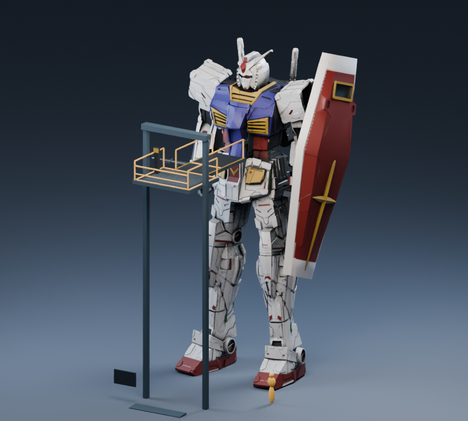
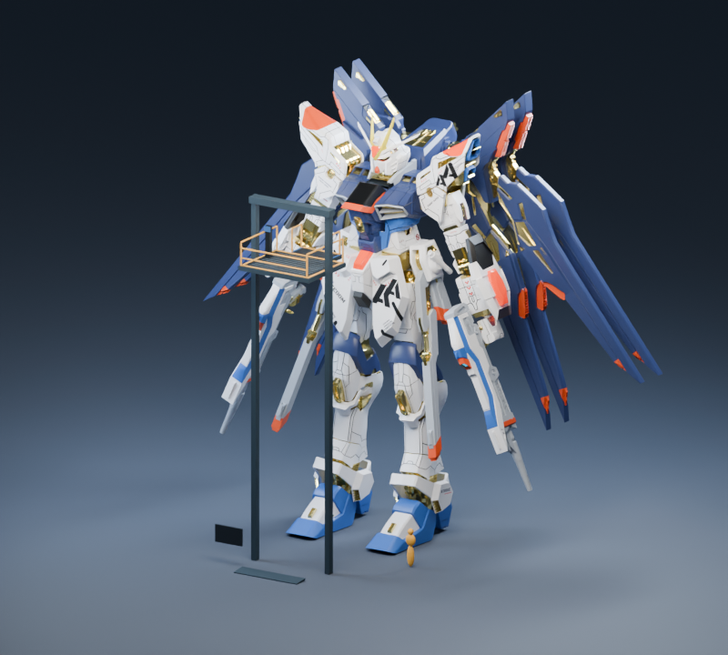
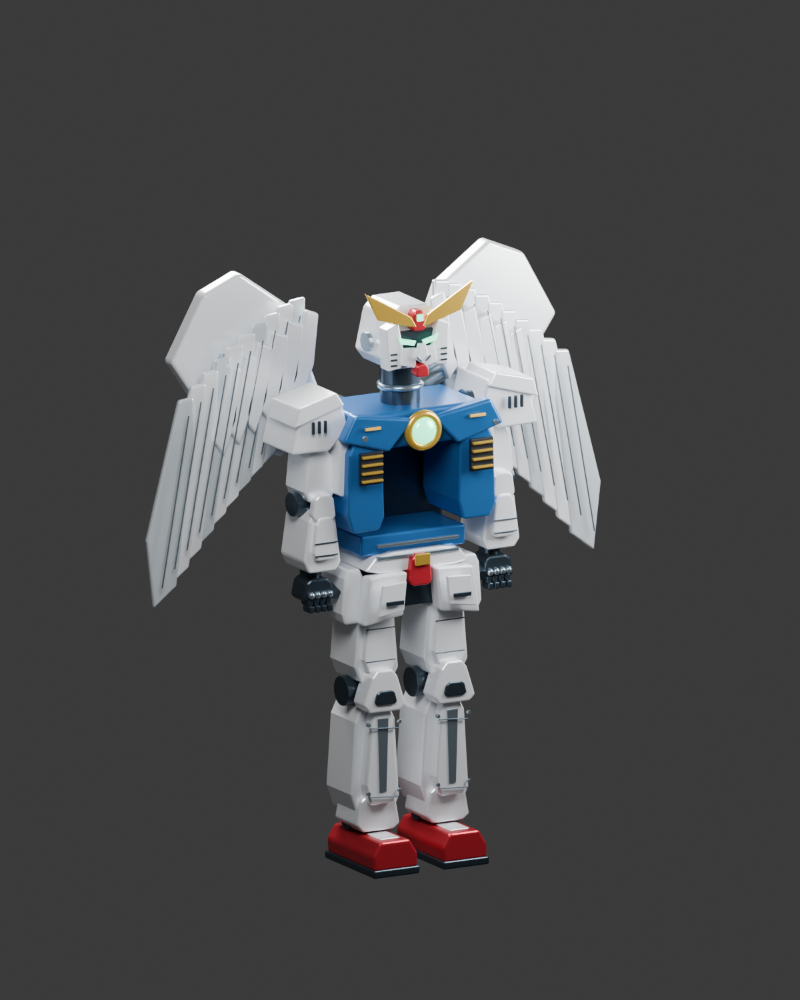

# GUNDAM · 巨构机库

第一人称机库探索与登舱原型。以 1.75 米驾驶员的视角观摩巨型机体，步行进入升降台、穿过检修桥、落座驾驶舱，完成供电、外部监视器和系统自检。

**2026-09-24 公开源码版**：六个可登舱机位与一个沙漠扎古观摩展位。RX-78-2、独角兽、ν 高达、强袭自由、能天使使用有来源记录的精细模型；B2 飞翼使用本项目已有的风格化程序模型。下载版飞翼的原始权利来源尚未解决，公开副本不包含该下载模型、贴图和派生预览。详见 [公开版说明](docs/公开版说明.md)。

## 运行

1. 安装 Godot 4.7.2，导入本目录的 `project.godot`，等待资源导入，按 F5 运行。
2. Windows 可把 Godot 加入 `PATH`，或设置 `GODOT_BIN` 为引擎路径，再运行 [启动游戏.cmd](启动游戏.cmd)；显卡较慢时使用 [流畅模式.cmd](流畅模式.cmd)。
3. 首次启动要导入贴图与模型。仓库提供源码与所需游戏资产，不附制作机的 EXE/PCK。

操作：WASD 行走，鼠标观察，Shift 快走，E 操作升降台/舱门/仪表，Q 离舱，Tab 导览，Esc 暂停并释放鼠标。完整流程见 [使用说明](使用说明.md)。

## 模型与制作

- [可编辑源文件与转换说明](source/README.md)：3 份 Blender 工程、程序建模/声音脚本、机体转换工具。
- [游戏模型](assets/models)：六个程序模型与当前使用的精细模型；独角兽采用 GLB 主体和相邻外置贴图。
- [机体资料与尺度](docs/机体资料与尺度.md)、[素材署名与许可](assets/机体素材来源.txt)。
- [公开版验证](docs/公开版验证.md)。

## 预览

以下是从已有游戏几何导出的 CPU 结构预览，非实时 GPU 截图。公开版更换了界面字体，画面中的历史界面字形可能不同。

公开版飞翼使用下方程序模型：

本原型尚无战斗、机体行走、飞行或变形。外部模型保留各作者署名；独角兽及其派生资产适用 CC BY-NC 4.0，仅非商业使用。高达角色和商标归相应权利人，素材页面许可不代表官方角色授权。本项目自有部分尚未指定统一开源许可证。
